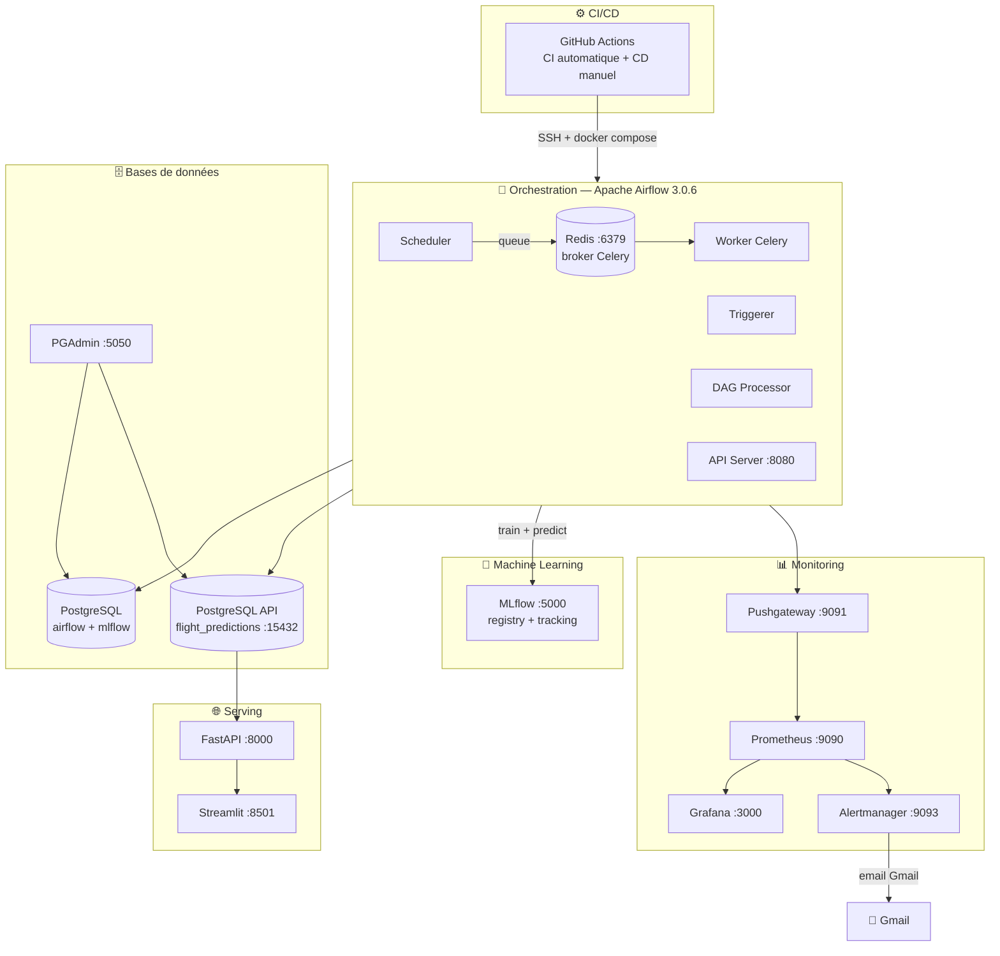
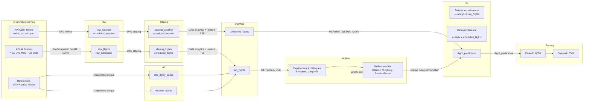
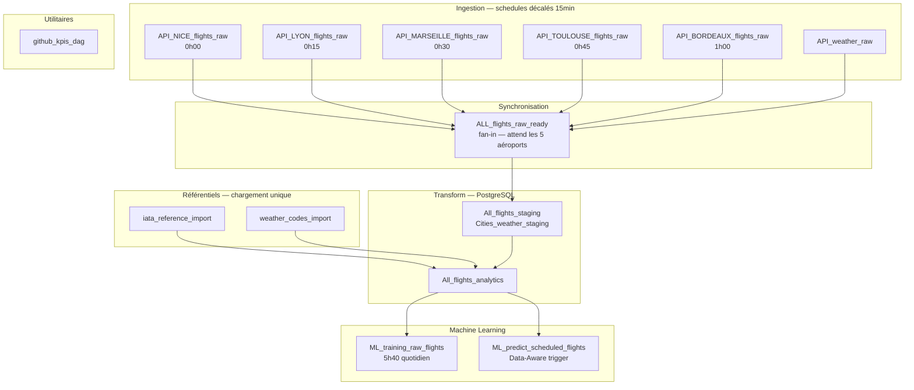

# Architecture DST Airlines

## 1. Architecture globale des services

---

## 2. Pipeline de données — du brut au serving

---

## 3. Les 15 DAGs — chaîne d'orchestration

---

## 4. Règles d'alerte Monitoring

| Alerte | Expression PromQL | Délai | Sévérité | Action |
|---|---|---|---|---|
| `AirflowDown` | `up{job="airflow"} == 0` | 1 min | critical | Email Gmail |
| `DAGFailed` | `sum(airflow_dag_last_status{status="failed"}) > 0` | 1 min | warning | Email Gmail |
| `FastAPIDown` | `up{job="fastapi"} == 0` | 1 min | critical | Email Gmail |

> `send_resolved: true` — une notification est envoyée aussi à la résolution de l'alerte.
